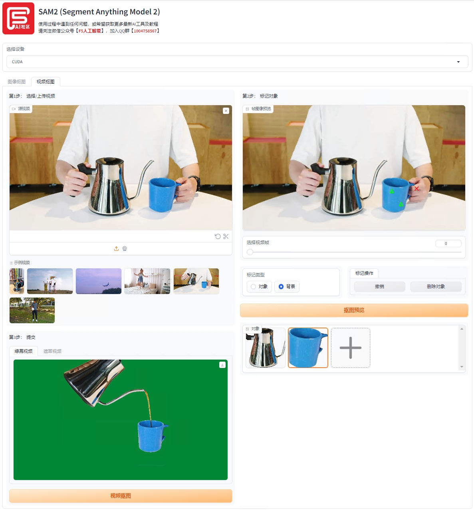

# 
SAM 2视频抠图一键整合包，基于Gradio交互界面

### 
[点击链接加入QQ群聊【F5 AI社区交流群】](https://qm.qq.com/q/UaxRVH3226)

## 关于SAM 2（Segment Anything Model 2）
---

继2023年4月开源SAM，实现对图像的精准抠图后，Meta近期开源了能够做视频抠图的新模型SAM 2（Segment Anything Model 2）。SAM 2将图像抠图和视频抠图功能整合到一个模型中。所谓“抠图”，是指区别视频中的特定对象与背景，并可以追踪目标。
SAM 2将图像抠图能力泛化到了视频领域，其响应能力和准确度是第一代SAM的6倍，也是目前最优秀的视觉分割模型。Meta AI发布此版本时强调：“相信我们的数据、模型和见解将成为视频分割和相关感知任务的重要里程碑。”

项目原地址：[https://github.com/facebookresearch/segment-anything-2](https://github.com/facebookresearch/segment-anything-2)

## 核心特性
---

* 高精度抠图：即便是发丝这样的细微之处也能处理得干净利落。
* 快速处理：响应能力和准确度是第一代 SAM 的 6 倍。
* 支持图片/视频抠图：除了静态图像抠图外，还支持视频中的动态对象抠图。
* Zero-Shot 泛化：无需额外训练即可识别不熟悉的物体和图像。
* 实时处理：只需单击一帧视频中的任何物体，即可实现对目标对象的实时追踪。

## 安装与使用
---

F5 AI 社区提供了基于Gradio的Web用户界面的 SAM2本地一键部署中文整合包，让技术小白也能轻松上手。

### 1.下载SAM2整合包

> 百度网盘
* 链接：https://pan.baidu.com/s/1lJRLuYxEy54Tnf70pSvStA?pwd=sjc6 
* 提取码：gtcy

> 123网盘
* 链接：https://www.123pan.com/s/5DsaTd-CLGc.html

> 夸克网盘
* 链接：https://pan.quark.cn/s/9847538ea706

### 2.保姆级教程

除了给大家准备了SAM2一键整合包，F5 AI社区还提供了详细的视频课程和图文教学资料以及一对一指导等服务。即便技术小白，也能确保一分钟熟练上手。

1. 下载SAM2整合包，将【SAM2.zip】压缩包下载到您的电脑本地。
2. 启动程序，解压【SAM2.zip】压缩包，找到【SAM2.exe】文件，双击启动程序。
3. 选择素材，在主界面点击【打开素材】按钮，选择你要处理的图片或视频。
4. 一键抠图，在素材上点击你想抠取的目标物，软件会自动识别并抠取，你可以通过调整选项来优化结果。
5. 导出结果，点击【下载】按钮，选择你想要保存的位置，即可将抠好的素材保存下来。

详细操作步骤及图解，可以参考微信公众号【F5人工智能】提供的[图文教程 https://mp.weixin.qq.com/s/9T8KIttLCK-dqFXFwDNvKg](https://mp.weixin.qq.com/s/9T8KIttLCK-dqFXFwDNvKg)

## SAM 2一键整合包特点
---

* **一键运行，免安装**：下载解压后即可使用。
* **汉化版**：全中文支持，符合中国人操作习惯。
* **无限制使用**：自定义上传素材，无模板限制，操作简单。
* **简洁的 UI 界面**：友好易懂，操作明了，轻松上手。
* **极致视频抠图效果**：支持视频中动态对象抠图，精准追踪。
* **极速抠图体验**：各种场景下实时抠图，速度极快。
* **服务保障**：提供图文 + 视频教程，7*12 小时一对一在线服务。

## 关于F5 AI社区
---
F5 AI社区是由麻省理工学院计算机科学博士、前OpenAI技术研究员Albert创办的AI学习社区，致力于通过整合全球前沿AI工具，提供详细的学习教程，并不断刷新（F5）产品和服务，为社区学员赋能，让每个人都能轻松利用AI工具，提升效率和价值。已助1000+用户在AI时代利用工具更好地生活和工作。

欢迎关注F5 AI社区微信公众号【F5人工智能】，获取最新前沿AI资讯、工具以及详细的教程。马上加入我们的技术交流群【QQ群：1004758567】，一起交流吧～

## 常见问题
---

* **问**：F5 AI社区支持在线指导吗？
* **答**：支持，可以下载安装包后，联系客服安排远程协助。

* **问**：F5 AI社区只提供SAM2工具吗？
* **答**：F5 AI社区不是AI工具开发商，我们的使命是帮助技术小白，快速掌握全球前沿AI知识，以适应新形势下的就业或商业市场，我们会不断提供最新、最前沿、效果最好的各类AI学习教程。

* **问**：SAM2使用对电脑配置有要求吗？
* **答**：SAM2作为视频抠图神器，当然是电脑配置越高越好，这样视频抠图会更加丝滑，建议初次使用，先拿几秒或十几秒钟的视频来替换，先测试下。建议使用 5G 以上显存的电脑，以获得更好的稳定性和运行速度。

* **问**：我是一点技术都不懂的小白，也能学会吗？
* **答**：F5 AI社区提供的整合包，可一键上手，无需专业技能。同时，详细的教程和24小时技术专家在线服务，确保你几分钟内快速掌握使用技巧，成为创意大师！

* **问**：可以在社交媒体平台上发布我的视频作品吗？
* **答**：是的，在遵守法律及道德准则、尊重隐私权并获得内容涉及个人的明确同意的情况下，可以在社交媒体平台上分享您的作品。在此之前，请您充分理解国家相关法律法规条例。